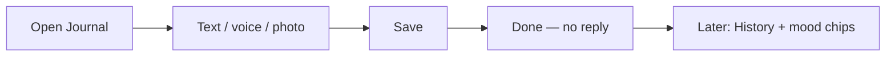
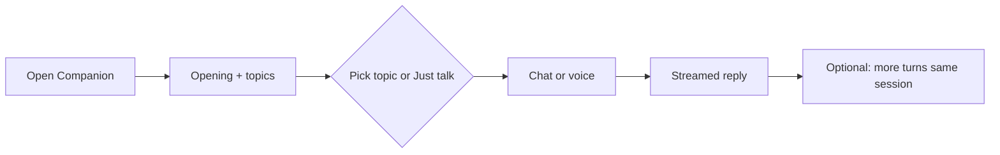
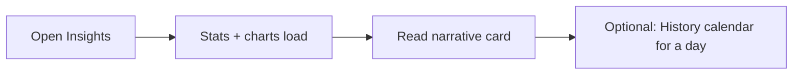

# Within — Product Guide

**Within** is a private, local-first space to capture how you feel and make sense of it over time. You journal without performing for an audience; you return to a companion that can ground replies in what you already wrote; you browse **History** and **Insights** to notice patterns—not to get a diagnosis.

This document describes **what the app does for people using it**: screens, flows, and product rules. For how it is built (FastAPI, Cactus, SQLite, agent loops, corpus indexing), see **[ARCHITECTURE.md](./ARCHITECTURE.md)**.

---

## Product promise

| Idea | What it means in the app |
|------|---------------------------|
| **Capture without performing** | **Journal** never talks back. No likes, no feed, no imagined audience. |
| **Continuity over fragments** | **Companion** and **Insights** connect days—not isolated vents. |
| **Emotional literacy** | Mood labels and charts help you **name** feelings and see repetition (e.g. stress after deadlines), not clinical scores. |
| **Local-first** | After models are downloaded once, your words, audio, and photos stay on this device. |
| **Non-clinical** | Warm companion tone; no diagnosis, no treatment advice. Crisis copy gently points to real-world support. |

---

## App map

Single-page shell with **bottom navigation** (five tabs). Only one full-screen “page” is visible at a time.

```
┌─────────────────────────────────────────┐
│  Home · Companion · Journal · History · Insights   ← bottom nav
├─────────────────────────────────────────┤
│                                         │
│   (active page content)                 │
│                                         │
└─────────────────────────────────────────┘
```

| Tab | What you get |
|-----|----------------|
| **Home** | Short greeting, privacy line, four cards into other areas |
| **Companion** | Opening greeting + topic cards, then chat (text / voice / photo) |
| **Journal** | Private write / voice / photo — **no AI reply** |
| **History** | Timeline or calendar of **your** past captures |
| **Insights** | Trends, heatmap, tags, optional weekly narrative |

**Naming note:** The tab says **Companion**; the page file is historically `reflect.html`. All companion chat uses `/api/companion/*`; opening the tab calls `/api/reflect/open` once per fresh session.

---

## When to use Journal vs Companion

| | **Journal** | **Companion** |
|---|-------------|----------------|
| **Expect a reply?** | No | Yes (streaming) |
| **Best for** | Dumping a moment, voice note, photo without discussion | Exploring a feeling, gentle back-and-forth, “remember when…” |
| **Voice** | Record → **auto-saves** when you stop | Record → **tap Send** to get a reply |
| **Image** | Attach + optional note → **Save entry** | Attach + message → companion responds |
| **Shows in History** | Yes (`mode: journal`) | Yes (`mode: companion`, your messages only) |

Both paths feed the same mood tagging and (over time) the companion’s ability to search past material.

---

## User journeys

### Journey A — “I just need to get it out”



### Journey B — “I want to talk it through”



### Journey C — “What’s been going on lately?”



---

## Home

**Purpose:** Orient and route—not a dashboard of live analytics.

- **Greeting** by time of day (“Good morning”, etc.).
- **Headline:** “What’s alive *within* you?”
- **Privacy line:** “Everything stays on this device.”
- **Four cards:** Journal, Companion, History, Insights (same destinations as the nav bar).
- **Streak dots** on Home are **decorative placeholders** today—they do **not** reflect your real streak. Use **Insights** for an actual day-streak count.

---

## Journal

**Purpose:** A private notebook. The UI never shows an assistant bubble.

### Text

- Large textarea (up to **8,000** characters), word count while typing.
- **Save entry** → immediate confirmation (“Saved ✓”); field clears on success.
- Requires **text and/or an attached image** (cannot save completely empty).

### Voice

- Tap mic → **Recording…** → tap again to stop.
- Audio uploads **automatically** (`mode: journal`)—no Send button.
- Entry appears in History quickly; **transcript and mood tags** fill in later (see [After you save](#after-you-save)).

### Photo

- Pick an image → thumbnail preview (× to remove).
- Optional text note with the photo.
- **Save** may create **two** records when both image and note exist: the image row plus a separate text entry so the note gets mood tagging.

### What you should expect

- No streaming, no tool indicators, no “companion is typing.”
- Background work still analyzes text (or transcript after voice) into **mood chips** for History and Insights.

---

## Companion

**Purpose:** A warm, bounded conversation partner that can search your past entries and recent mood patterns—on device.

### First open (Reflect open)

When you open the tab with an empty thread:

1. Input is **hidden** while the app “catches up.”
2. You see step text such as “Reading your recent entries…”, “Finding what stands out…”, “Putting it together…”
3. Then: **one greeting bubble** + **topic cards** + input appears.

If you **return to the tab** with messages already in the log, the open sequence **does not run again**. A **browser session cache** (`sessionStorage`) can also restore the last thread when you leave and come back.

**Sparse history:** If you have almost no mood-tagged entries yet, you get a gentle static greeting and a single **“Something else”** card—not the full topic set or **Just talk**.

### Topic cards

Topics are chosen by **rules over your last ~14 days of mood tags**—not by asking the model to pick themes. Up to **four** insight cards plus **Just talk**.

| Type | What it’s about | Example label |
|------|-----------------|----------------|
| `pattern` | A negative mood category showed up often (≥3×) | Stress, Worry, Low mood, Frustration |
| `trend` | Average mood drifted down over several days | Mood shift |
| `tag` | A specific feeling word recurred (≥4×) | Busy, Lonely, Happy moments, … |
| `silence` | Long gap since last tagged day | Where you’ve been |
| `positive` | Noticeably good stretch | Something good |
| `just_chat` | No structured prompt | **Just talk** |

**Structured topic:** Tapping a card locks the picker and **starts the thread**—the assistant’s first reply streams in. Your later messages stay tied to that topic’s question (the app prepends invisible context so replies stay on theme).

**Just talk:** Assistant says it’s here; you type or speak freely—**no** topic prefix.

**Skip the picker:** Sending a message without choosing a card behaves like **Just talk**.

**New:** Clears the thread, session cache, and runs a fresh open sequence.

### Chat

- Textarea up to **2,000** characters; **Enter** sends, **Shift+Enter** newline.
- Replies **stream** token by token.
- You may see brief **tool steps** (e.g. searching entries)—that means the companion is grounding in your history before answering.
- **Session** continues across turns until you tap **New**; the app keeps a `session_id` for context.

### Voice (Companion)

Unlike Journal, voice is **two steps:** record → **Send**. Status shows “Voice ready — tap Send.”

You get a streamed reply **immediately** from the model hearing audio directly (PCM → Gemma, not Parakeet). The voice file is saved, but **companion voice is not auto-transcribed** into searchable journal text—that pipeline is **Journal-only**.

### Image (Companion)

- Attach photo + optional caption, then **Send**.
- The photo is sent to the companion in the same request (**multipart** `POST /api/companion/chat`); Gemma sees the image for that turn’s reply (not text-only with a placeholder).
- The file is also saved on disk; a background caption is written later for **search** in future turns (same as journal images).

### Companion boundaries (product)

- Short replies (roughly a few sentences), at most **one question** per turn.
- **No unsolicited advice** unless you ask.
- **No clinical labels** or diagnosis.
- If you seem in crisis, copy may gently mention professional support—not automated crisis routing.

### Optional cloud coping (off by default)

If you enable cloud handoff in `.env`, questions like **“How can I cope with stress?”** may show **☁️ Cloud coping tips…** and a status line that your **journal was not sent**. Reflective chat (“why have I felt drained?”) and crisis messages stay on-device. This uses **Cactus Cloud**, not a separate OpenAI key.

---

## History

**Purpose:** Browse **your** captures (`role: user` only)—not assistant messages or internal summaries.

### Timeline (default)

- Newest first (up to **200** entries).
- Grouped headers: **Today**, **Yesterday**, or a date.
- Each card: **Journal** vs **Companion** chip, text/voice/image marker, preview text, optional thumbnail.
- **Mood chips:** colored **category** pill + smaller **sub-tags**.
- **Mood bar:** width reflects valence; color reflects category.

**Empty:** “No entries yet. Start by talking or journaling.”

### Calendar

- Current month grid; days with activity show a **memory orb**—an SVG mosaic whose **colored bands** mix mood **categories** from that day (stable shape per date).
- Days with activity but **no mood tags** use a neutral orb.
- Tap a day → list below with expandable cards (voice shows transcript + **tone** line when ready; voice still processing shows a placeholder).

### Six mood families (what chips mean)

| Category | Everyday meaning |
|----------|------------------|
| **Positive** | Ease, joy, contentment |
| **Stress** | Pressure, busy, depleted |
| **Anxiety** | Worry, tension about the future |
| **Low mood** | Down, empty, low energy |
| **Anger** | Irritation, unfairness |
| **Social** | Loneliness, shame, comparison, envy |

Under each family, **sub-tags** are short controlled words (e.g. `overwhelmed`, `lonely`)—at most three per entry. Tags are **automatic** from your words (or transcript), not something you pick manually.

**Colors** (timeline and calendar): positive yellow, stress orange, anxiety purple, low mood blue, anger red, social green.

### UX quirks (History)

- Calendar day cards label everything except legacy `chat` as **“Journal”**—so **Companion** entries can read as Journal in calendar detail. Timeline view shows **Companion** correctly.
- **Daily conversation summaries** exist in the database for archiver use but **are not shown** in History today.

---

## Insights

**Purpose:** Aggregate view of mood over time—not free-form Q&A.

Loads when you open the tab (`/api/stats` + optional narrative). Day boundaries, streaks, and heatmap cells use your **browser’s local calendar date** (not UTC midnight).

| Element | Meaning |
|---------|---------|
| **Entries this month** | Sum of mood-tagged activity days in the current month (from stats aggregates) |
| **Day streak** | Consecutive days with tagged activity, walking back from today |
| **Mood vs last month** | % change in average valence vs previous month (↑ green / ↓ red, or —) |
| **14-day sparkline** | Recent valence trend (needs ≥2 days of data to draw) |
| **Heatmap** | ~100 days: color from valence + intensity; tap cells for tooltip |
| **Emotion breakdown** | Bar chart of the six categories |
| **Common feelings** | Most frequent sub-tags |
| **Narrative card** | Three sentences written over your stats (“Reflecting on your entries…” while loading); hidden if no data |

**Empty states:** e.g. “No data yet — keep journaling!”, “No category data yet.”

---

## After you save

What happens **without you waiting on a spinner** (typical timing: background loops every **~2 minutes** for media, **~5 minutes** for day summaries).

| You saved | You see immediately | Fills in later |
|-----------|---------------------|----------------|
| Journal text | History row + soon mood chips | — |
| Journal voice | History row, “processing” if needed | Transcript, tone line, mood chips |
| Journal photo | Thumbnail in History | Emotional caption (for search); mood tags **only if you also saved a text note** |
| Companion text | Your bubble + streamed reply | Mood tags on your message |
| Companion voice | Reply stream + voice row | Transcript, tone, mood tags |
| Companion image | Your bubble + streamed reply (model sees the photo) | Image caption in background (for later search) |

**Tone summary** (voice): a short note about **how you sounded**, separate from the transcript—both can appear in History and feed memory.

**Companion memory:** Past entries are searchable once exported and the local index has refreshed (usually shortly after save; see [ARCHITECTURE.md](./ARCHITECTURE.md)). If the model is busy, refresh may wait until the next sync. In-session tools and mood stats still help for recent context.

---

## Privacy and offline

- **No account** — single-user, this machine.
- **Local by default** — inference runs on your machine after setup. Optional Cactus Cloud for some companion coping questions only if you set `CLOUD_HANDOFF=true` and `CACTUS_CLOUD_KEY` in `.env` (see README).
- **Data on disk:** SQLite database, `data/audio/`, `data/images/`, and text exports used for search—not sent to a vendor API as part of normal use.
- **Home + companion copy** stress that content stays on the device.

First visit shows **“Loading Gemma 4…”** while the local model warms up; after that, core flows work offline.

---

## Demo data (`seed/`)

For judges or developers: run `python -m seed` from the repo root to load **~90 days** of hand-written journal and companion/chat rows with mood tags—**wiping** existing entries and moods. Useful to preview History, Insights, and Companion topics without journaling for months. Does not create real audio, images, or search corpus files. Edit `seed/records.py` to change the narrative.

---

## Known limitations (product)

| Topic | What users might notice |
|-------|-------------------------|
| Home streak | Decorative only; real streak is on **Insights** |
| History scope | Your messages only—not assistant replies |
| Day summaries | Generated in background, not shown in UI |
| Image-only journal | Mood tags only when you added a text note |
| Search freshness | Brand-new exports may lag until background corpus sync + index refresh (rarely needs restart) |
| Web MVP | Mobile-first layout in the browser; not a native App Store build |
| Reflect empty state | “Something else” vs normal **Just talk** card set |

---

## Related docs

| Document | Use when you need… |
|----------|-------------------|
| **[ARCHITECTURE.md](./ARCHITECTURE.md)** | Modules, agent phases, Cactus/RAG, schema, HTTP/SSE contracts |
| **[README.md](./README.md)** (repo root) | Clone Cactus, download weights, run the server |
| **[writeup.md](./writeup.md)** | Hackathon submission narrative (paste into Kaggle) |

---

*Within · non-clinical · local-first · capture first, understand over time*
